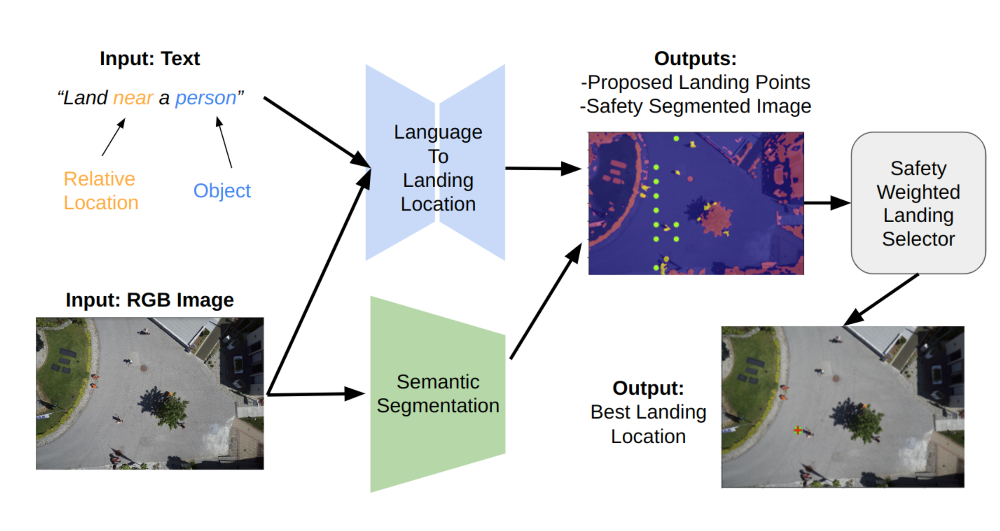

# uav-landing-nlp
Guided UAV Landing with Natural Language Instructions

There are two ML components here
 - CLIP (Contrastive Language-Image Pre-Training)
   - check out the docs in the `clip` directory
   - Training: `python3 train.py` (with transfer learning of pretrained weights)
   - Zero-shot demonstration with cars: `clip_zero_shot_tests.ipynb`
 - Aerial image Semantic seg 
   - DeepLabV3+ model yields the best result
   - checkout the jupyter notebook: `aerial-semantic-segmentationl.ipynb`
 - Full NLP uav-landing pipeline:
   - notebook: `full_nlp_landing_pipeline.ipynb`
   - includes the "safety weighted landing selector"

Dataset:
 - `aerial-sematic-segmentation-dataset`
   - Use for  `segmentic Segmentation`
   - https://www.kaggle.com/datasets/bulentsiyah/semantic-drone-dataset
 - `semantic_drone_dataset_processed`:
   - Use for `CLIP` model training, images are cropped and generated from the above "semantic-drone-dataset"
   - [link](https://drive.google.com/drive/folders/1CwQwrTuoVC0FptFpd1qd0Mx1VR9EuHyv)
   - Consist of redcross on aerial image to describe spatial info
   - Added [COCO dataset](https://cocodataset.org/#download) to augment the dataset
